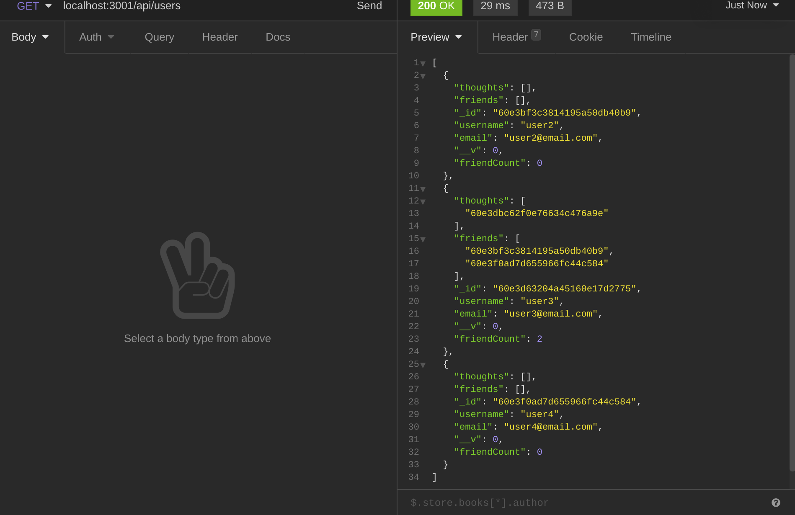
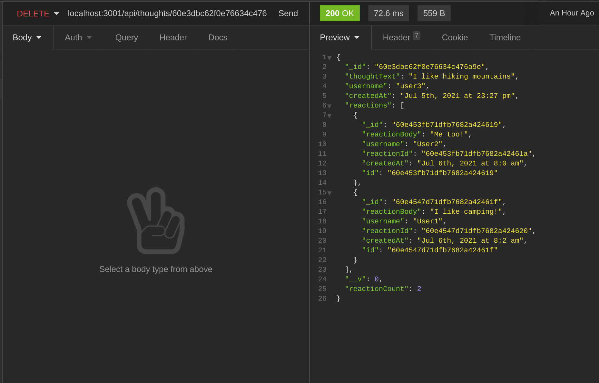

# Social Network

## Description
A social network API application that allows users to share their thoughts, react to friends' thoughts, and create a friend list

## Made With
* JavaScript
* MongoDB
* Node.js

## Packages
* Express.js
* Mongoose

## Usage
1. Download social-network repository
2. Run <code>npm i</code> to install the dependencies
3. Run <code>npm start</code> to start application
4. Use Insomnia Core to test API endpoints

## Snapshots

## Demo

* [Walkthrough Link](https://drive.google.com/file/d/1l_qYxLiD9818VnZk1KiePzaBJ4KMyqC1/view)

## Credit
Angela Man